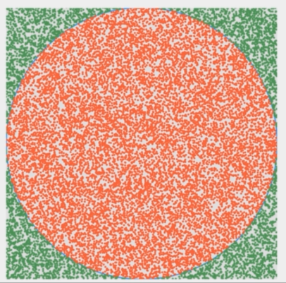

# 3.2 GetPIProgram
使用蒙特卡洛模拟方法获得Π的值

## 什么是蒙特卡洛？

    通过大量的随机样本，去了解一个系统，进而得到所要计算的值

## 使用蒙特卡洛模拟圆的Π值

   

    S圆 = ΠR²
    S正方形 = 4R²
    Π = 4(S圆/S正方形) => 我们的程序中推导出 Π = 4(红点数/总点数)

## 程序设计

    1. 创建Circle类，构造一个方法判断一个点所处的坐标是否在圆内。代码如下：
    
        public class Circle {
        
            private int x, y, r;
        
            public Circle(int x, int y, int r) {
                this.x = x;
                this.y = y;
                this.r = r;
            }
        
            public int getX() {
                return x;
            }
        
            public int getY() {
                return y;
            }
        
            public int getR() {
                return r;
            }
        
            // 点所处的位置是否在圆内
            public boolean contain(Point p) {
                return Math.pow(p.getX() - x, 2) + Math.pow(p.getY() - y, 2) <= r*r;
            }
        }
    
    2. 新建MonteCarloPiData.java，封装数据计算及方法
    
        // 数据计算
        public class MonteCarloPiData {
            private Circle circle;
            private LinkedList<Point> points;
            private int insideCircle = 0;
        
            public MonteCarloPiData(Circle circle) {
                this.circle = circle;
                points = new LinkedList<>();
            }
        
            public Circle getCircle() {
                return circle;
            }
        
            // 获取列表中的某个元素
            public Point getPoint(int i) {
                if (i < 0 || i >= points.size()) {
                    throw new IllegalArgumentException("out of bound in getPoint!");
                }
                return points.get(i);
            }
        
            // 获取所有点的数量（估算正方形的面积）
            public int getPointsNumber() {
                return points.size();
            }
        
            // 添加一个点
            public void addPoint(Point p) {
                points.add(p);
                if (circle.contain(p)) {
                    insideCircle++;
                }
            }
        
            // 估算Π的值
            public double estimatePi() {
                if (points.size() == 0) {
                    return 0.0d;
                }
                int circleArea = insideCircle;
                int squareArea = points.size();
                return (double) circleArea * 4 / squareArea;
            }
        }
    
    2. AlgoVisualizer类
    
        public class AlgoVisualizer {
        
            private static int DELAY = 40;
            private MonteCarloPiData data;
            private AlgoFrame frame;    // 视图
            private int N;  // 打点的总数
        
            public AlgoVisualizer(int sceneWidth, int sceneHeight, int N){
        
                if (sceneWidth != sceneHeight) {
                    throw new IllegalArgumentException("This demo must be run in a square!");
                }
        
                // 初始化数据
                Circle circle = new Circle(sceneWidth / 2, sceneHeight / 2, sceneWidth / 2);
                data = new MonteCarloPiData(circle);
                this.N = N;
        
                // 初始化视图
                EventQueue.invokeLater(() -> {
                    frame = new AlgoFrame("GetPIProgram", sceneWidth, sceneHeight);
                    new Thread(() -> run()).start();
                });
            }
        
            // 动画逻辑
            private void run(){
                for (int i = 0; i < N; i++) {
                    if (i % 100 == 0) {     // 一次打100个点
                        frame.render(data);
                        AlgoVisHelper.pause(DELAY);
                        System.out.println(data.estimatePi());
                    }
            
                    int x = (int) (Math.random() * frame.getCanvasWidth());
                    int y = (int) (Math.random() * frame.getCanvasHeight());
            
                    data.addPoint(new Point(x, y));
                }
            }
        }
        
    3. AlgoFrame中具体的绘制方法
    
        // 具体绘制
        Circle circle = data.getCircle();
        AlgoVisHelper.setStrokeWidth(g2d, 3);
        AlgoVisHelper.setColor(g2d, AlgoVisHelper.Blue);
        AlgoVisHelper.strokeCircle(g2d, circle.getX(), circle.getY(), circle.getR());
        
        for (int i = 0; i < data.getPointsNumber(); i++) {
            Point p = data.getPoint(i);
            if (circle.contain(p)) {    // 点的坐标在圆上，设置为红色
                AlgoVisHelper.setColor(g2d, AlgoVisHelper.Red);
            } else {    // 点的坐标不再圆上，设置为绿色
                AlgoVisHelper.setColor(g2d, AlgoVisHelper.Green);
            }
            // 画点
            AlgoVisHelper.fillCircle(g2d, p.x, p.y, 3);
        }