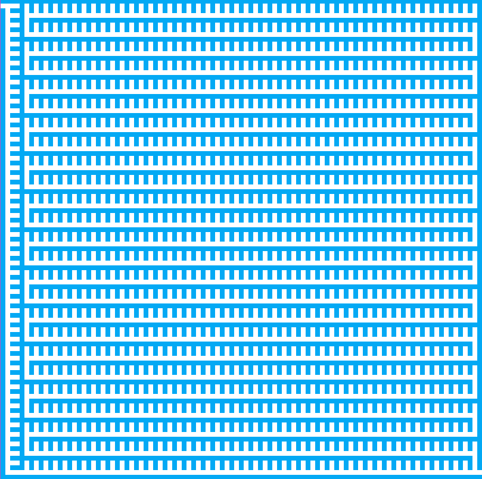
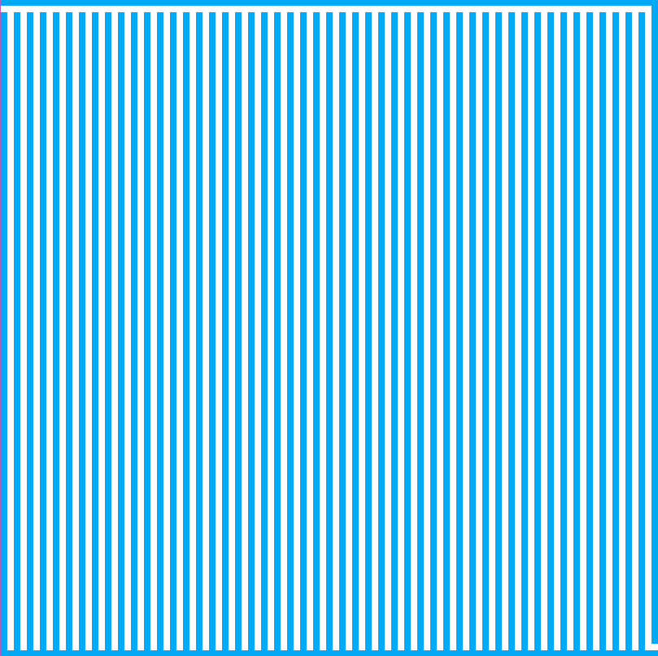
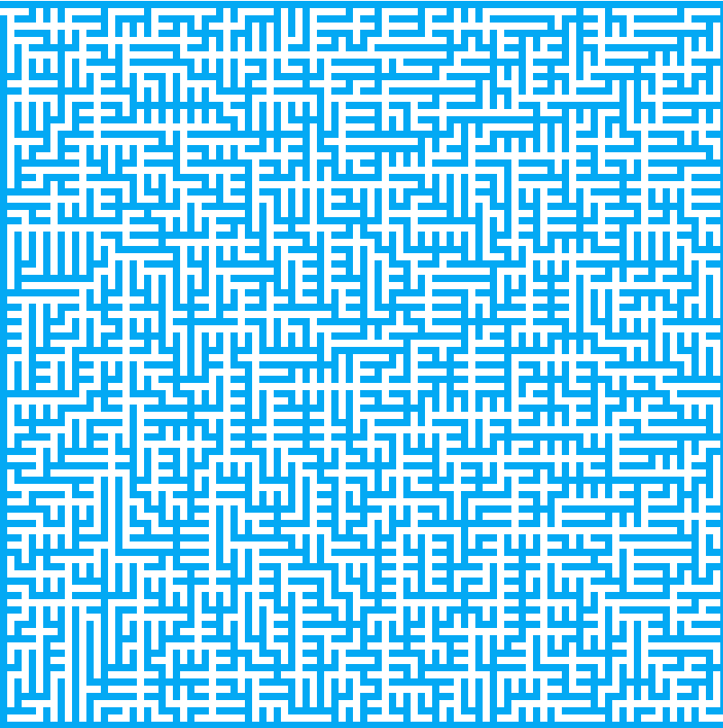
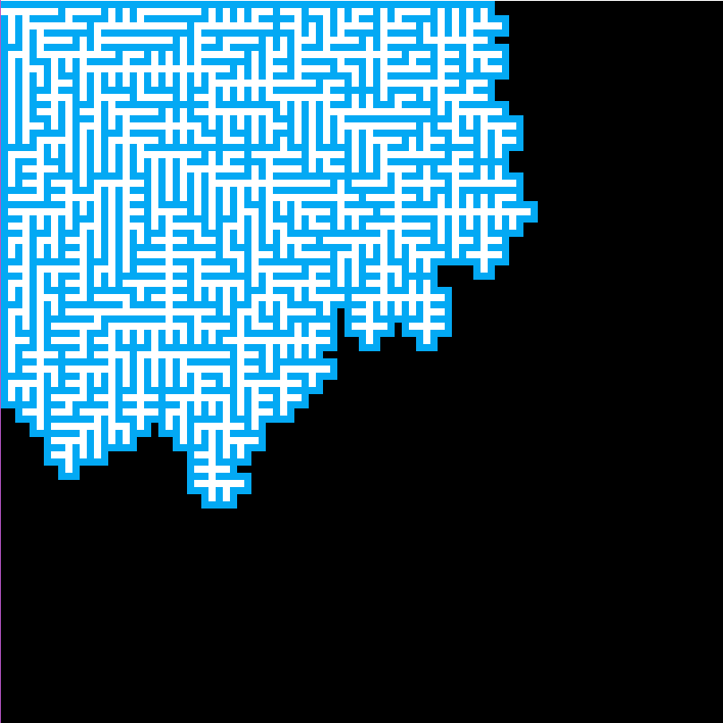
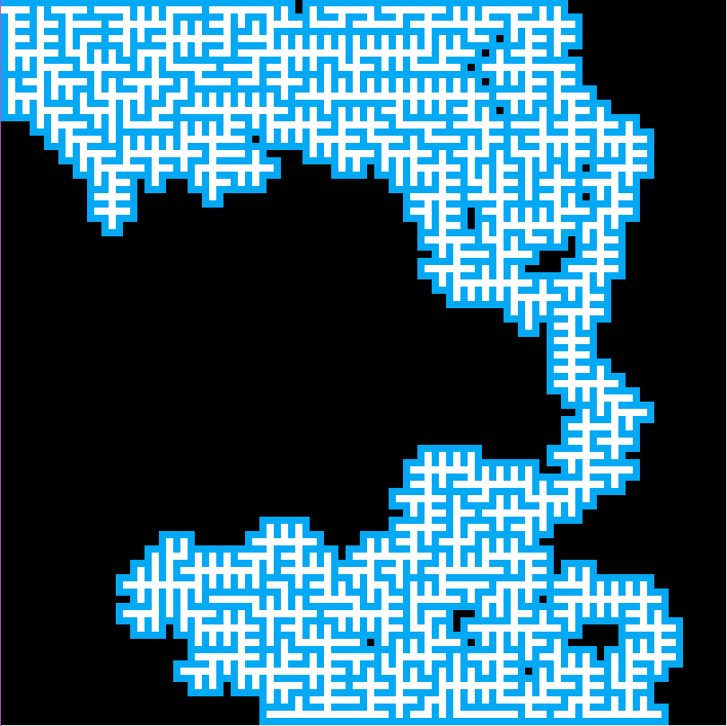
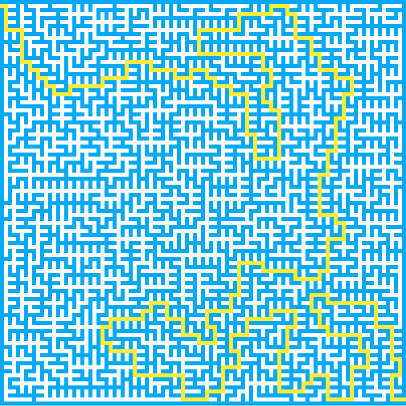

# 随机生成迷宫

## 一、生成一个基础迷宫图

   1. MazeData.java
    
          public class MazeData {
        
            public static final char ROAD = ' ';    // 路
            public static final char WALL = '#';    // 墙
        
            private int N, M;
            public char[][] maze;
            public boolean[][] visited;
        
            private int entranceX, entranceY;
            private int exitX, exitY;
        
            public MazeData(int N, int M) {
                if (N % 2 == 0 && M % 2 == 0) {
                    throw new IllegalArgumentException("Our Maze Generalization Algorihtm requires the width and height of " +
                            "the maze are odd numbers");
                }
        
                this.N = N;
                this.M = M;
        
                maze = new char[N][M];
                visited = new boolean[N][M];
                for (int i = 0; i < N; i++) {
                    for (int j = 0; j < M; j++) {
                        if (i%2 == 1 && j%2 == 1) {
                            maze[i][j] = ROAD;
                        } else {
                            maze[i][j] = WALL;
                        }
                        visited[i][j] = false;
                    }
                }
        
                entranceX = 1;
                entranceY = 0;
                exitX = N - 2;
                exitY = M - 1;
        
                maze[entranceX][entranceY] = ROAD;
                maze[exitX][exitY] = ROAD;
            }
        
            public int N() {
                return N;
            }
        
            public int M() {
                return M;
            }
        
            public int getEntranceX() {
                return entranceX;
            }
        
            public int getEntranceY() {
                return entranceY;
            }
        
            public int getExitX() {
                return exitX;
            }
        
            public int getExitY() {
                return exitY;
            }
        
            public boolean inArea(int x, int y) {
                return x >= 0 && x < N && y >= 0 && y < M;
            }
          }
        
   2. AlgoFrame.java 具体绘制
    
            int w = canvasWidth / data.M();
            int h = canvasHeight / data.N();
            for (int i = 0; i < data.N(); i++) {
            for (int j = 0; j < data.M(); j++) {
                if (data.maze[i][j] == MazeData.WALL) {  // 如果为#，为墙，设置为浅蓝色
                    AlgoVisHelper.setColor(g2d, AlgoVisHelper.LightBlue);
                } else {    // 空白处设置为白色
                    AlgoVisHelper.setColor(g2d, AlgoVisHelper.White);
                }
    
                AlgoVisHelper.fillRectangle(g2d, j * w, i * h, w, h);
            }
            
   3. AlgoVisualizer.java 动画渲染
   
            private void setData() {
                frame.render(data);
                AlgoVisHelper.pause(DELAY);
            }
            
   4. 最终渲染的结果
   
   

## 二、通过广度优先遍历生成一个迷宫（递归非随机）

   1. 继续做动画渲染操作，使用递归完成深度优先遍历，打通墙的连接，形成一个迷宫
   
        AlgoVisualizer.java
            
            // 动画逻辑
                private void run() {
                    setData(-1, -1);
            
                    // 初始点
                    go(data.getEntranceX(), data.getEntranceY() + 1);
            
                    setData(-1, -1);
                }
            
                private void setData(int x, int y) {
                    if (data.inArea(x, y)) {
                        data.maze[x][y] = MazeData.ROAD;
                    }
                    frame.render(data);
                    AlgoVisHelper.pause(DELAY);
                }
            
                private void go(int x, int y) {
                    if (!data.inArea(x, y)) {
                        throw new IllegalArgumentException("x, y are out of bound!");
                    }
            
                    data.visited[x][y] = true;
                    for (int i = 0; i < 4; i++) {
                        int newX = x + d[i][0] * 2;
                        int newY = y + d[i][1] * 2;
                        if (data.inArea(newX, newY) && !data.visited[newX][newY]) {
                            setData(x + d[i][0], y + d[i][1]);
                            go(newX, newY);
                        }
                    }
                }
   
   2. 最终形成的结果如下
   
      
   
## 三、通过广度优先遍历生成一个迷宫（非递归非随机）  

   1. 继续做动画渲染操作，使用非递归完成深度优先遍历，打通墙的连接，形成一个迷宫
   
        private void go() {
            Stack<Position> stack = new Stack<>();
            Position first = new Position(data.getEntranceX(), data.getEntranceY() + 1);
            stack.push(first);
            data.visited[first.getX()][first.getY()] = true;
    
            while (!stack.isEmpty()) {
                Position curPos = stack.pop();
    
                for (int i = 0; i < 4; i++) {
                    int newX = curPos.getX() + d[i][0] * 2;
                    int newY = curPos.getY() + d[i][1] * 2;
    
                    if (data.inArea(newX, newY) && !data.visited[newX][newY]) {
                        stack.push(new Position(newX, newY));
                        data.visited[newX][newY] = true;
                        setData(curPos.getX() + d[i][0], curPos.getY() + d[i][1]);
                    }
                }
            }
        }

   2. 最终实现结果如下
   
   
   
## 广度优先遍历生成一个迷宫

   1. 使用队列来实现广度优先遍历
   
        private void go1() {
            LinkedList<Position> queue = new LinkedList<>();
            Position first = new Position(data.getEntranceX(), data.getEntranceY() + 1);
            queue.addLast(first);
            data.visited[first.getX()][first.getY()] = true;
    
            while (queue.size() != 0) {
                Position curPos = queue.removeFirst();
    
                for (int i = 0; i < 4; i++) {
                    int newX = curPos.getX() + d[i][0] * 2;
                    int newY = curPos.getY() + d[i][1] * 2;
    
                    if (data.inArea(newX, newY) && !data.visited[newX][newY]) {
                        queue.addLast(new Position(newX, newY));
                        data.visited[newX][newY] = true;
                        setData(curPos.getX() + d[i][0], curPos.getY() + d[i][1]);
                    }
                }
            }
        }
        
   2. 最终实现结果如下
   
   
   
## 使用随机队列生成随机迷宫

   1. 底层数据结构：数组
   2. 入队：把元素放入数组
   3. 出队：从数组中随机选择一个元素
   4. 不需要维护数据中间的联系性，也就是这么操作，随机选择元素出队，选择随机的元素和数组末端的元素交换位置，然后出队
   5. 构建一个随机删除一个随机元素的队列，详情见代码： RandomQueue.java
   6. 使用随机队列生成一个随机迷宫
   
            // 使用随机队列遍历
            private void go2() {
                RandomQueue<Position> queue = new RandomQueue<>();
                Position first = new Position(data.getEntranceX(), data.getEntranceY() + 1);
                queue.add(first);
                data.visited[first.getX()][first.getY()] = true;
        
                while (queue.size() != 0) {
                    Position curPos = queue.remove();
        
                    for (int i = 0; i < 4; i++) {
                        int newX = curPos.getX() + d[i][0] * 2;
                        int newY = curPos.getY() + d[i][1] * 2;
        
                        if (data.inArea(newX, newY) && !data.visited[newX][newY]) {
                            queue.add(new Position(newX, newY));
                            data.visited[newX][newY] = true;
                            setData(curPos.getX() + d[i][0], curPos.getY() + d[i][1]);
                        }
                    }
                }
            }
   
   
   
## 优化我们的代码，隐藏生成方式

   我们将还没有生成的地方用黑色掩盖，随着迷宫的生成，逐步打开迷宫，直至生成所有的迷宫位置，消除全部黑色的部分
   
   
   
## 生成随机性更强的迷宫

   现在的迷宫中有很强的引导性，入口左上，出口右下，路径近似与左上到右下
   1. 我们使用底层数据结构为链表来实现一个随机队列，用这个随机队列生成随机性更强的迷宫
   2. 入队：随机入队首或者队尾
   3. 出队：随机从队首或者队尾挑选元素
   4. 随机迷宫的生成
   
   
   
   6. 添加键盘时间 融合寻找迷宫路径算法
   
   