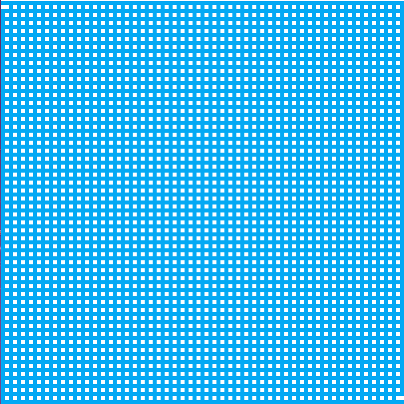
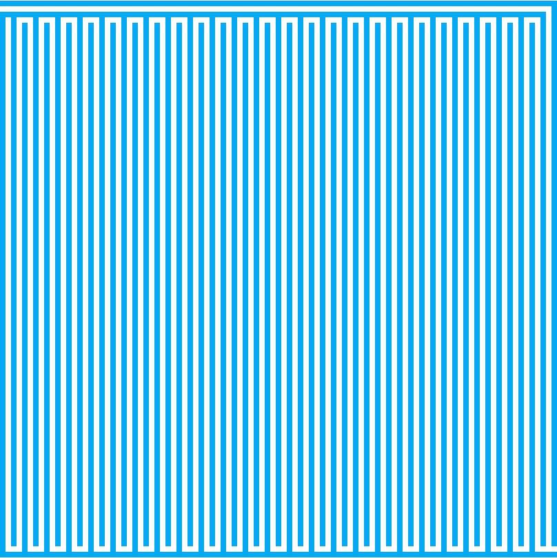

# 随机生成迷宫

## 一、生成一个基础迷宫图

   1. MazeData.java
    
          public class MazeData {
        
            public static final char ROAD = ' ';    // 路
            public static final char WALL = '#';    // 墙
        
            private int N, M;
            public char[][] maze;
            public boolean[][] visited;
        
            private int entranceX, entranceY;
            private int exitX, exitY;
        
            public MazeData(int N, int M) {
                if (N % 2 == 0 && M % 2 == 0) {
                    throw new IllegalArgumentException("Our Maze Generalization Algorihtm requires the width and height of " +
                            "the maze are odd numbers");
                }
        
                this.N = N;
                this.M = M;
        
                maze = new char[N][M];
                visited = new boolean[N][M];
                for (int i = 0; i < N; i++) {
                    for (int j = 0; j < M; j++) {
                        if (i%2 == 1 && j%2 == 1) {
                            maze[i][j] = ROAD;
                        } else {
                            maze[i][j] = WALL;
                        }
                        visited[i][j] = false;
                    }
                }
        
                entranceX = 1;
                entranceY = 0;
                exitX = N - 2;
                exitY = M - 1;
        
                maze[entranceX][entranceY] = ROAD;
                maze[exitX][exitY] = ROAD;
            }
        
            public int N() {
                return N;
            }
        
            public int M() {
                return M;
            }
        
            public int getEntranceX() {
                return entranceX;
            }
        
            public int getEntranceY() {
                return entranceY;
            }
        
            public int getExitX() {
                return exitX;
            }
        
            public int getExitY() {
                return exitY;
            }
        
            public boolean inArea(int x, int y) {
                return x >= 0 && x < N && y >= 0 && y < M;
            }
          }
        
   2. AlgoFrame.java 具体绘制
    
            int w = canvasWidth / data.M();
            int h = canvasHeight / data.N();
            for (int i = 0; i < data.N(); i++) {
            for (int j = 0; j < data.M(); j++) {
                if (data.maze[i][j] == MazeData.WALL) {  // 如果为#，为墙，设置为浅蓝色
                    AlgoVisHelper.setColor(g2d, AlgoVisHelper.LightBlue);
                } else {    // 空白处设置为白色
                    AlgoVisHelper.setColor(g2d, AlgoVisHelper.White);
                }
    
                AlgoVisHelper.fillRectangle(g2d, j * w, i * h, w, h);
            }
            
   3. AlgoVisualizer.java 动画渲染
   
            private void setData() {
                frame.render(data);
                AlgoVisHelper.pause(DELAY);
            }
            
   4. 最终渲染的结果
   
   

## 二、通过广度优先遍历生成一个迷宫（非随机）

   1. 继续做动画渲染操作，使用递归完成深度优先遍历，打通墙的连接，形成一个迷宫
   
        AlgoVisualizer.java
            
            // 动画逻辑
                private void run() {
                    setData(-1, -1);
            
                    // 初始点
                    go(data.getEntranceX(), data.getEntranceY() + 1);
            
                    setData(-1, -1);
                }
            
                private void setData(int x, int y) {
                    if (data.inArea(x, y)) {
                        data.maze[x][y] = MazeData.ROAD;
                    }
                    frame.render(data);
                    AlgoVisHelper.pause(DELAY);
                }
            
                private void go(int x, int y) {
                    if (!data.inArea(x, y)) {
                        throw new IllegalArgumentException("x, y are out of bound!");
                    }
            
                    data.visited[x][y] = true;
                    for (int i = 0; i < 4; i++) {
                        int newX = x + d[i][0] * 2;
                        int newY = y + d[i][1] * 2;
                        if (data.inArea(newX, newY) && !data.visited[newX][newY]) {
                            setData(x + d[i][0], y + d[i][1]);
                            go(newX, newY);
                        }
                    }
                }
   
   2. 最终形成的结果如下
   
        

    