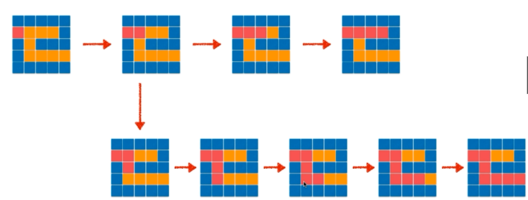
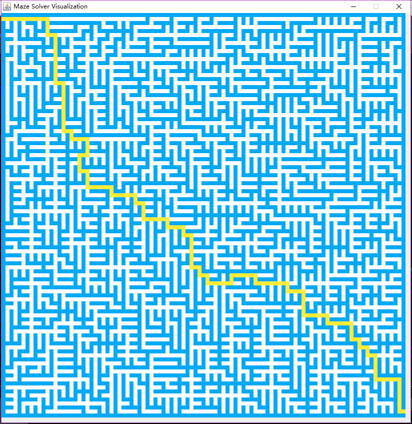
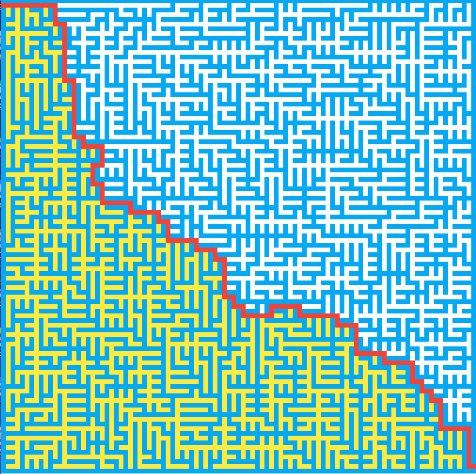
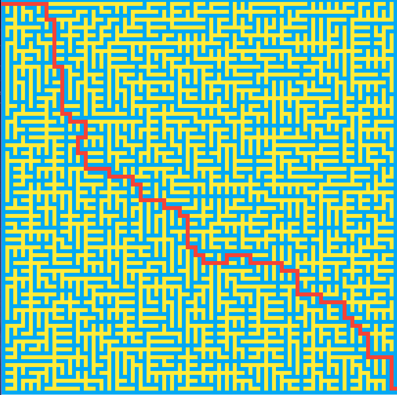

# 走迷宫

## 一、读取一个txt文本文件在控制台生成一个迷宫

    通过Java的IO读取本地类路径下的一个txt文本文件到控制台
    
    MazeData.java
    
        import java.io.BufferedInputStream;
        import java.io.InputStream;
        import java.util.Scanner;
        
        // 处理迷宫数据，生成迷宫
        public class MazeData {
        
            private int N, M;   // N 行数， M 列数
        
            private char[][] maze;
        
            public MazeData(String fileName) {
                if (fileName == null) {
                    throw new IllegalArgumentException("fileName cannot be null!");
                }
        
                Scanner scanner = null;
                try {
                    InputStream is = getClass().getResourceAsStream(fileName);
                    scanner = new Scanner(new BufferedInputStream(is), "UTF-8");
        
                    // 读取第一行
                    String nmline = scanner.nextLine();
                    String[] nm = nmline.trim().split("\\s+");
        
                    N = Integer.parseInt(nm[0]);
                    M = Integer.parseInt(nm[1]);
        
                    maze = new char[N][M];
                    // 读取后续的N行
                    for (int i = 0; i < N; i++) {
                        String line = scanner.nextLine();
        
                        // 每行保证有M个字符
                        if (line.length() != M) {
                            throw new IllegalArgumentException("Maze file " + fileName + " is invalid!");
                        }
        
                        for (int j = 0; j < M; j++) {
                            maze[i][j] = line.charAt(j);
                        }
                    }
                } catch (Exception ex) {
                    ex.printStackTrace();
                } finally {
                    if (scanner != null) {
                        scanner.close();
                    }
                }
            }
        
            public int N() {
                return N;
            }
        
            public int M() {
                return M;
            }
        
            public char getMaze(int i, int j) {
                if (!isArea(i, j)) {
                    throw new IllegalArgumentException("i or j is out of index in getMaze!");
                }
                return maze[i][j];
            }
        
            // 判断x,y坐标是否在迷宫的范围内
            public boolean isArea(int x, int y) {
                return x >= 0 && x < N && y >= 0 && y < M;
            }
        
            public void print() {
                System.out.println(N + " " + M);
                for (int i = 0; i < N; i++) {
                    for (int j = 0; j < M; j++) {
                        System.out.print(maze[i][j]);
                    }
                    System.out.println();
                }
            }
        }

    Main.java 
    
        public static void main(String[] args) {
            String mazeFile = "maze_101_101.txt";
            MazeData data = new MazeData(mazeFile);
            data.print();
        }
        
## 二、生成迷宫视图

  MazeData.java中添加两个静态变量
    
    public static final char ROAD = ' ';
    public static final char WALL = '#';
        
  AlgoFrame.java中初始化数据
  
    private MazeData data;
    public void render(MazeData data){
        this.data = data;
        repaint();
    } 
  
  AlgoFrame.java中具体的绘制代码
  
    int w = canvasWidth / data.M();
    int h = canvasHeight / data.N();
    for (int i = 0; i < data.N(); i++) {
        for (int j = 0; j < data.M(); j++) {
            if (data.getMaze(i, j) == MazeData.WALL) {  // 如果为#，为墙，设置为浅蓝色
                AlgoVisHelper.setColor(g2d, AlgoVisHelper.LightBlue);
            } else {    // 空白处设置为白色
                AlgoVisHelper.setColor(g2d, AlgoVisHelper.White);
            }
            AlgoVisHelper.fillRectangle(g2d, j * w, i * h, w, h);
        }
    }
    
  AlgoVisualizer.java中构造函数构造相应的数据和实现相应的动画逻辑
  
    private static int DELAY = 20;
    private MazeData data;        // 数据
    private static int blockSide = 8;   // 一个小格像素为8
  
    public AlgoVisualizer(String mazeFile) {
    
        // 初始化数据
        data = new MazeData(mazeFile);
        
        ...
    }
  
    private void run(){
        setData();
    }

    private void setData() {
        frame.render(data);
        AlgoVisHelper.pause(DELAY);
    }
    
## 三、迷宫问题和图的遍历

  1. 迷宫求解问题等价于图的遍历，图的遍历包括两种：深度优先遍历和广度优先遍历
  2. 这里先举例深度优先遍历来求解迷宫问题
  3. 我们把求解迷宫的问题抽象一下，假设入口坐标为(1, 0)，出口坐标为(N-2, M-1) N表示坐标行数，M表示坐标列数。使用递归的方式遍历
  4. 从(1, 0)坐标开始，依照如下规律分别依次尝试：上 -> 右 -> 下 -> 左。进一步抽象称为伪码为：
  
    向上：solveMaze(x, y-1)
    向右：solverMaze(x+1, y)
    向下：solverMaze(x, y+1)
    向左：solverMaze(x-1, y)
        
  5. 当(x, y)坐标 = (N-2, M-1)时，遍历停止
  6. 注意，遍历时只能向没有被访问过的坐标移动，穷举所有的可能性，一般这种方式都包含遍历、递归、回溯等方法
  
  
  
## 四、深度优先遍历递归走迷宫

  1. MazeData.java中添加四个标记，并在构造函数中初始化
  2. AlgoVisualizer.java实现动画逻辑
  3. AlgoFrame.java具体绘制走迷宫的路径颜色
  
## 五、迷宫问题与回溯法

  
  
## 六、使用非递归的方法求解迷宫

  1. 使用非递归方法需要使用栈结构，但是回溯方法比较复杂
  2. 还是按照递归的方法将数据按照上左下右依次压入栈中，取出栈中的坐标判断是否为可走的结果，然后再在新的结果上继续执行压入栈、取出栈的过程，直到求到迷宫的解
  3. 最终求得的解在标记上红颜色，显示最终迷宫的解的路径
  
  
  
## 七、广度优先遍历的方法求解迷宫

  1. 类似使用非递归方法的使用栈数据结构，广度优先遍历使用队列实现优先遍历
  2. 按照上左下右的顺序依次将符合条件的坐标压入队列，取出队列判断是否为可走的结果，然后再新的结果上继续执行压入队列、从队列中取出的过程，知道求得迷宫的解
  3. 最终求得的解在标记上红颜色，显示最终迷宫的解的路径
  
  
  
## 八、深度优先遍历与广度优先遍历的关系

  1. 代码逻辑完全相同
  2. 入队出队的规则不同